# Инструкция по организации разработки с помощью механизма эталонных баз данных

<b>Автор</b>: Агибалов Сергей

<b>Дата</b>: 10.07.2026

<a href="https://yoomoney.ru/to/4100119287125731" style="Font-family: segoe script; Font-size: 20px; text-decoration: none; color: #000000; Font-weight: bold">Donate</a>

## Подготовка эталонной базы данных

### Выгрузка эталонных данных

#### Настройка состава выгрузки эталонных данных

Первый этап подготовки эталонной базы данных - это настройка выгрузки эталонных данных.

> [!Note]
>
> Под эталонными данными понимаются данные, которые не несут собой клиентской специфики работы в информационной базе и не чувствительны к утечкам:
>
> - Настройки информационной базы - данные из констант, кроме логинов и паролей.
> - Технические справочники. Например, "Идентификаторы объектов метаданных".
> - Предопределенные значения справочников (их рекомендуется выгружать всегда во избежание дальнейших ошибок и дублирования).
> - Центральные узлы обмена  (их рекомендуется выгружать всегда во избежание дальнейших ошибок и дублирования).
> - Классификаторы (*Банки*, *Валюты* и т.д.).
> - Различные справочные данные, которые сами по себе не предоставляют информации об организации (*Статьи доходов и расходов*, *Статьи движения денежных средств*, *Дополнительные реквизиты и сведения* и т.д.).

Для подготовки эталонных данных необходимо:

1. В рабочей информационной базе или в ее свежей копии открыть помощник для работы с конфигурацией

   1. Включить режим анализа данных

      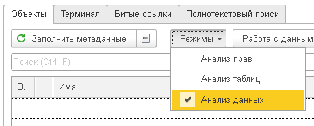

   2. Заполнить дерево метаданных со статистикой

      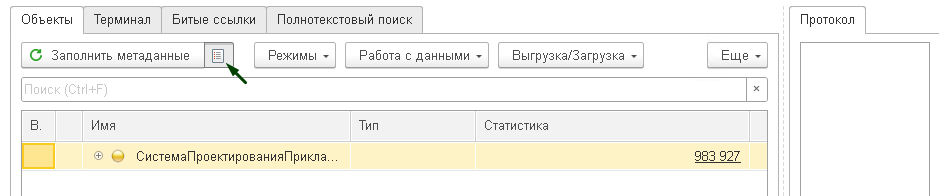

   3. Выполнить отбор по заполненным данным

      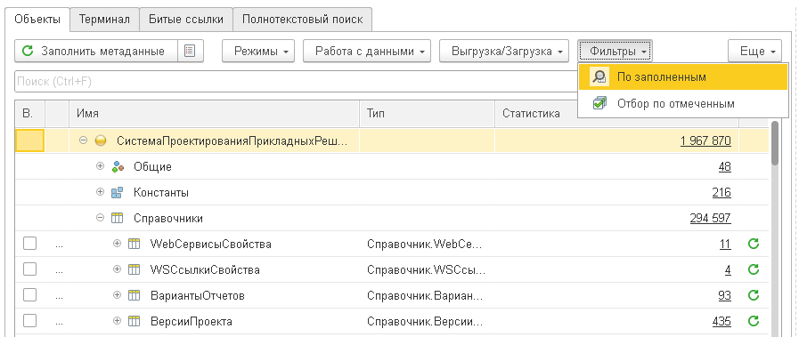

2. Для ускорения заполнения данных обязательных к выгрузке можно выполнить команды
   1. Отметить константы

      1. Будут отмечены все константы с простыми и ссылочными типами данных

   2. Отметить предопределенные данные

      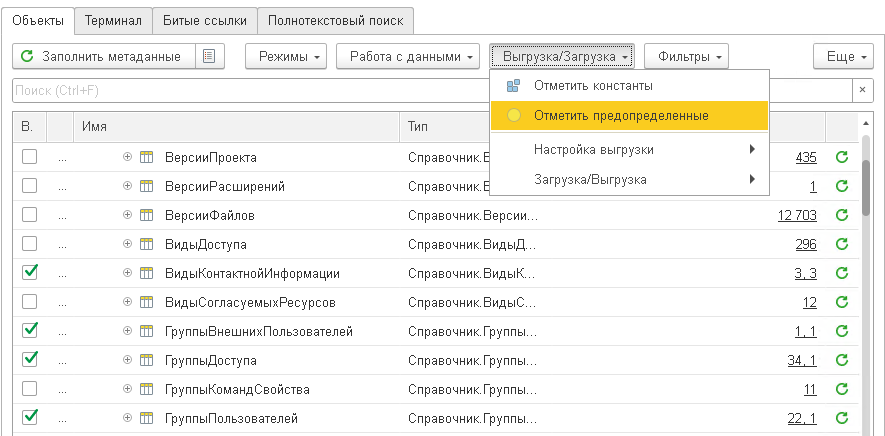

3. Далее необходимо выполнить окончательную настройку выгрузки данных

   1. Пройти по каждому объекту

   2. Проверить предназначение объекта

   3. Если объект был отмечен на шаге 2, проверить корректность отметки.

   4. Если объект не отмечен, принять решение по его отметке

      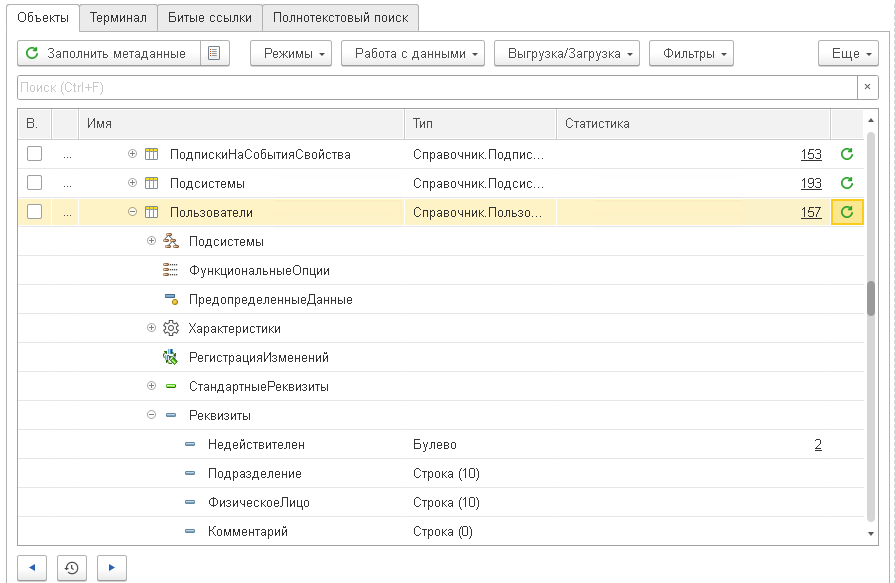

   5. Если в объекте есть как нужные к выгрузке данные, так и данные, которые нельзя выгружать, необходимо настроить отбор по выгружаемым данным

      1. Отбор может быть настроен по реквизиту объекта

         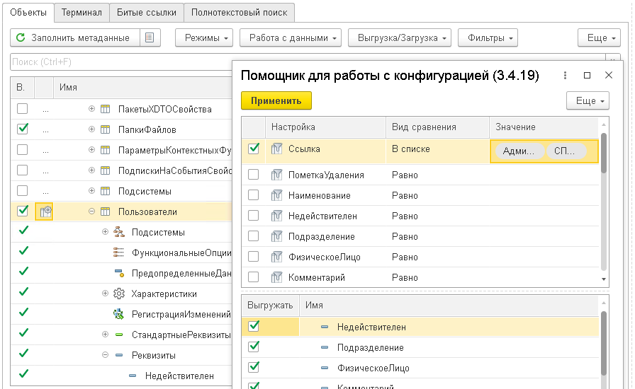

      2. Отбор может быть настроен по реквизитам ссылочного реквизита объекта

         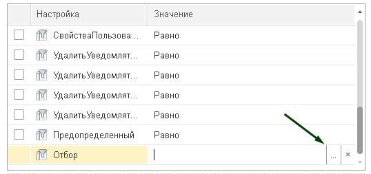

         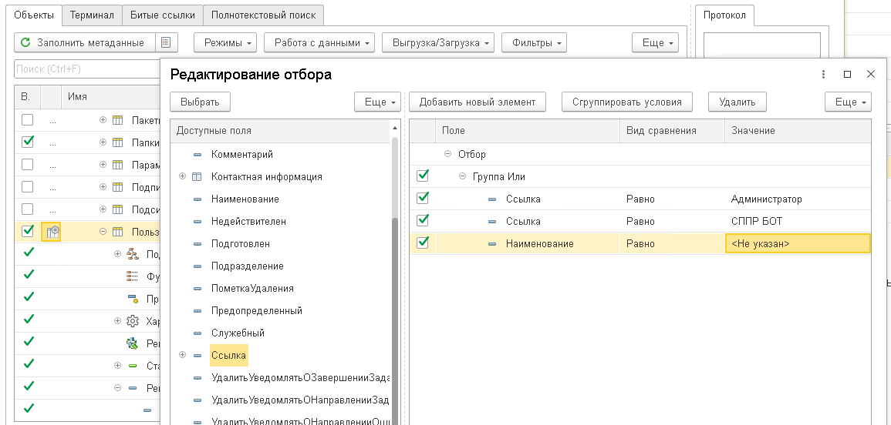

   6. Если в объекте есть реквизиты, которые нужно при выгрузке очистить, это можно указать в настройках выгрузки.

      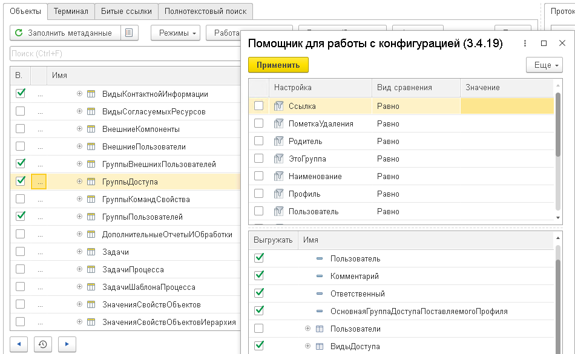

#### Параметры выгрузки эталонных данных

Вторым этапом идет сама выгрузка данных.

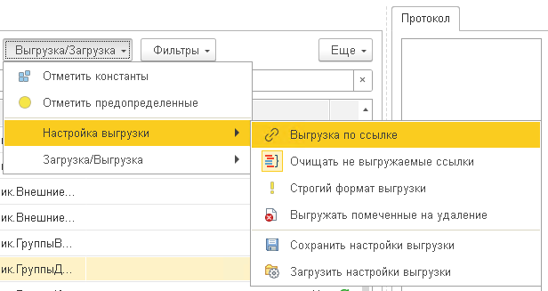

Для эталонной выгрузки данных необходимо указать следующие настройки:

- Выгрузка по ссылке - **нет**
- Очищать не выгружаемые ссылки - **да**
- Строгий формат выгрузки - **нет**
- Выгружать помеченные на удаление - **нет**

##### Выгрузка по ссылке

В этом режиме выгружается не только отмеченный объект, но все ссылки, которые находятся в реквизитах данного объекта, и все ссылки в реквизитах выгруженных ссылок. Для эталонной выгрузки это избыточная настройка, нам нужно жестко контролировать, что мы выгружаем.

##### Очищать не выгружаемые ссылки

Для эталонной выгрузки главным критерии успешности является отсутствие битых ссылок по итогам загрузки. Для этого включается режим анализа целостности выгрузки: если реквизиты объекта, который отмечен к выгрузке, содержат ссылки объектов, которые не отмечены к выгрузке, то данные ссылки будут очищены, и сообщение об очистке выйдет в протоколе выгрузки. Причем, если реквизит объекта имеет составной тип, то для каждого типа будет проведен отдельный анализ.

Если будут очищены обязательные для заполнения ссылки, например, "Владелец", то объект не будет выгружен целиком. Об этом также будет сообщено в логе выгрузки.

##### Строгий формат выгрузки

Строгий формат выгрузки выгружает данные в формате **xml**. Такой формат данных можно загрузить в информационную базу с идентичной конфигурацией.

Не строги формат выгрузки выгружает данные в формате **json**. Такой формат данных можно загрузить в информационную базу, отличающуюся по составу метаданных от основной информационной базы.

##### Выгружать помеченные на удаление

Считается, что при корректном учете помеченных на удаление объектов в информационной базе не быть должно. Поэтому по умолчанию выгружаются только не помеченные на удаление объекты.

Анализ целостности выгрузки помогает дополнительно найти объекты, которые попали в эталонную выгрузку, а ссылки в реквизитах этих объектов помечены на удаление, соответственно при выгрузке эти реквизиты будут очищены, о чем будет сообщено в протоколе выгрузки.

В итоге можно эти данные исправить в рабочей базе, и либо поменять реквизиты в объекте выгрузки, либо снять пометку на удаление. После чего повторить выгрузку.

##### Сохранение настроек выгрузки

Все настройки выгрузки можно сохранить и восстановить.

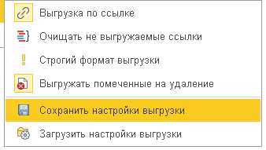

##### Обработка ошибок выгрузки

В итоге при выгрузке мы получаем следующие данные по факту выгрузки:

- Файл выгрузки

- Протокол выгрузки
  - Список и количество выгруженных объектов
  
  - Сообщения об очистке реквизитов объектов
  
  - Сообщение об невыгруженных объектов
  
    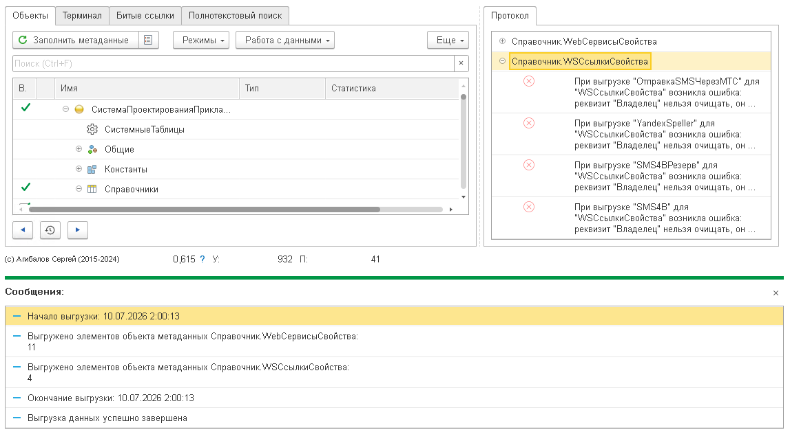

В идеале сообщений об очистке реквизитов объектов и о невыгруженных объектов быть не должно.

При каждой итерации выгрузки перенастраиваются выгружаемые объекты, или отмечаются новые объекты до тех пор, пока число сообщений протокола не достигнет удовлетворительного минимума

### Загрузка эталонных данных

#### Загрузка данных с удалением

Третьим этапом выполняется загрузка данных.

Для эталонных данных нужно подготовить пустую информационную базу:

1. Выгрузить актуальную конфигурацию.

2. Загрузить ее в подготовленную пустую информационную базу

3. Запустить информационную базу и дождаться окончания обработчиков первоначального заполнения

   > [!Warning]
   >
   > Если при запуске возникают ошибки, их нужно устранить.

4. Запустить загрузку эталонных данных.

Для загрузки необходимо выбрать файл эталонных данных, и отметить флаг очистки несовпадающих элементов.

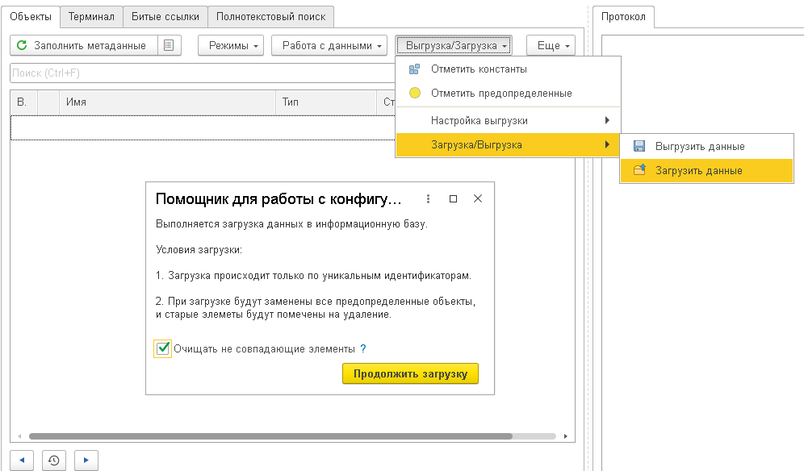

При таких настройках загрузка выполнит следующие шаги:

- При загрузке каждого элемента он будет сравнивать с соответствующем элементов в загружаемой информационной базе.
- Если элементы различаются, или он отсутствует, произойдет его загрузка.
- Загрузка происходит блоками по типам в одной транзакции.
- При этом полностью блокируется таблица метаданных.
- Все элементы, которые есть в информационной базе, но нет в файле эталонных данных будут помечены на удаление, и произойдет попытка их удаления.
- После загрузки всех данных произойдет повторная попытка удаления всех оставшихся помеченных на удаление элементов.

#### Анализ эталонной информационной базы после загрузки

Четвертым этапом необходимо проанализировать целостность загружаемых данных.

После загрузки необходимо выполнить следующие шаги:

1. Запустить поиск помеченных на удаление элементов, и провести анализ, почему они не были удалены при загрузке.

   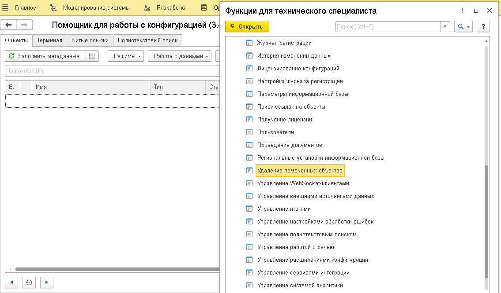

2. Запустить поиск битых ссылок из помощника для работы с конфигурацией, и провести анализ, почему они появились.

   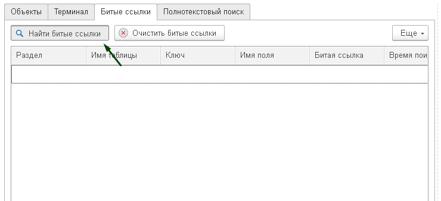

3. После шагов 1-2 возможно нужно будет перенастроить и повторить выгрузку, после чего повторить загрузку (при загрузке запишутся только новые или измененные объекты).
   1. В общем случае помеченных на удаление и битых ссылок быть не должно, все отбрасывается на этапе выгрузки.
   2. На этапе загрузки помеченные элементы должны быть высвобождены новым блоком данных и удалены.
   3. Возможны особенности настройки выгрузки, которые нужно подправить.
   4. Также возможны ошибки в обработке, что помеченные на удаление элементы не высвобождаются, или возникают битые ссылки, такие случае нужно зафиксировать в Issue для их исправления.

### Регулярное обновление эталонной базы

Как только были пройдены все этапы выгрузки и загрузки эталонных данных, и в эталонной информационной базе перестали появляться помеченные на удаление объекты или битые ссылки, настройка выгрузки считается законченной и ее можно применять для регулярного обновления эталонной информационной базы.

## Подготовка информационной базы для разработки

### Создание информационной базы для разработки

Информационная база разработки может создаваться двумя способами:

- Копирование эталонной информационной базы с загрузкой клиентских данных.
- Создание пустой информационной базы с загрузкой эталонных данных, а затем, клиентских данных.

Первый вариант предпочтительней.

### Выгрузка клиентских данных

#### Настройка состава выгрузки клиентских данных

Выгрузка клиентских данных рекомендуется выполнять в режиме выгрузки по ссылке. Это означает, что с указанным объектом выгрузятся все подчиненные ссылки.

Чтобы избежать избыточности выгрузки, необходимо указывать точечные отборы выгружаемых данных.

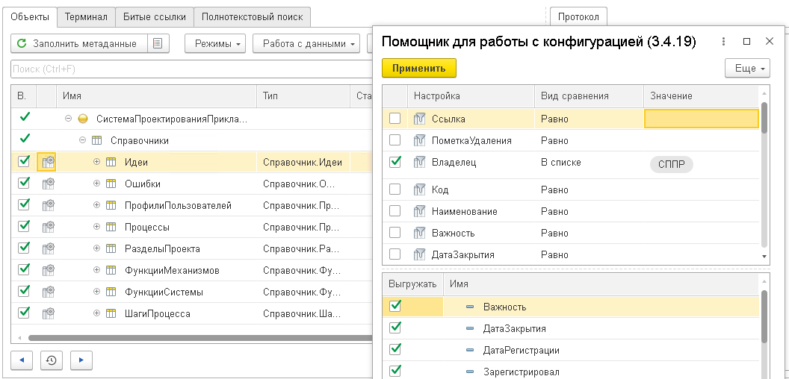

> [!Warning]
>
> При неизбирательных отборах очень легко захватить половину базы при выгрузке одной ссылки.

#### параметры выгрузки клиентских данных

Для эталонной выгрузки данных необходимо указать следующие настройки:

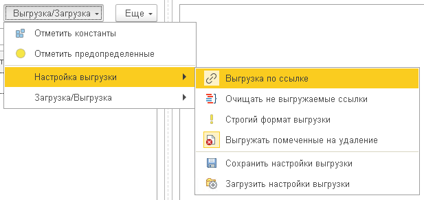

- Выгрузка по ссылке - **да**
- Очищать не выгружаемые ссылки - **нет**
- Строгий формат выгрузки - **нет**
- Выгружать помеченные на удаление - **да/нет** (по усмотрению)

В данном случае будет формироваться уже клиентский слепок данных. При корректной подготовке эталонной информационной базы, пользовательский слепок будет накладывать на данные без ошибок и задвоение.

### Загрузка клиентских данных без удаления

При загрузке клиентских данных крайне важно не указывать очистку несовпадающих элементов.

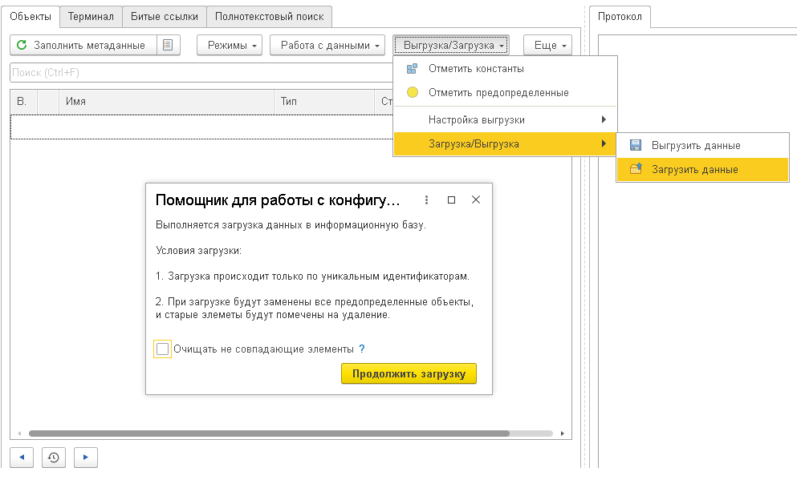

После завершения загрузки можно начинать разработку с тестированием только на необходимым и достаточным блоке данных.
